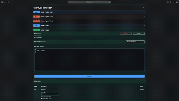
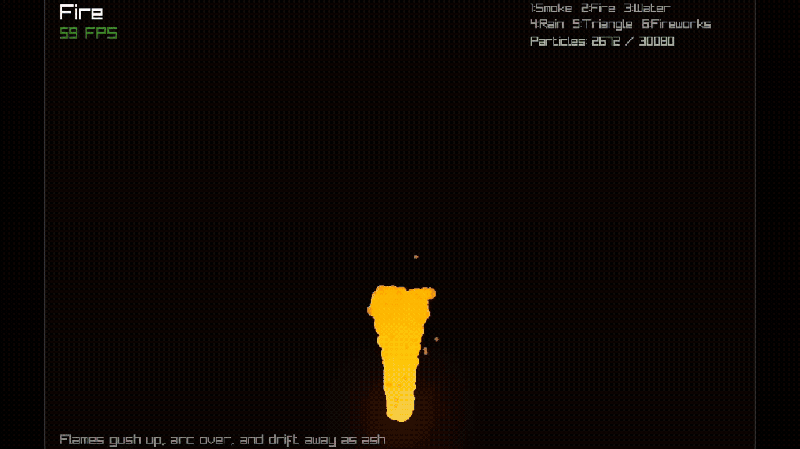
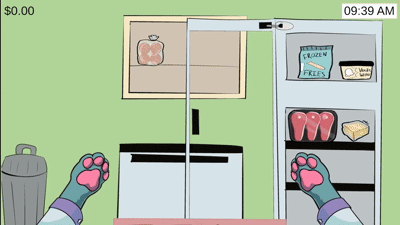
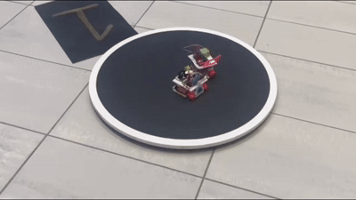

# *"Stay awhile and README!"*

👋🏻 Hey! I'm Betmann, ***Software Developer***.

🏗️ Doing a Postgrad in ***Java Architecture & Development***

🛠️ Building a [***Python/Django Project***](https://github.com/vitorbetmann/404)

📖 Reading [***Unity In Action***](https://www.manning.com/books/unity-in-action-third-edition)

🕹️ Playing [***Darkwood***](https://www.darkwoodgame.com)

# *"Would you kindly check out my projects?"*

<table width="100%">
  <tr>
    <td width="50%" align="center" valign="top">
      
       
      <b>🍽️ <a href="https://github.com/vitorbetmann/clean-resmapi">Clean Resmapi</a></b>
       
      Restaurant API in <b><i>Java/Spring Boot</i></b>. Clean Architecture, 99% instruction coverage.
    </td>
    <td width="50%" align="center" valign="top">
      
       
      <b>😊 <a href="https://github.com/vitorbetmann/smile">Smile</a></b>
       
      2D game library in <b><i>C</i></b>. 260+ tests, CI on three OSes. Used to build <a href="https://github.com/vitorbetmann/made-with-smile">three game remakes</a>.
    </td>
  </tr>
  <tr>
    <td width="50%" align="center" valign="top">
      
       
      <b>🐮 <a href="https://github.com/tiffne/Joannas-Diner">Joanna's Diner</a></b>
       
      Cooking game in <b><i>Unity/C#</i></b>. Gameplay programmer on a five-person student team. <a href="https://theojammm.itch.io/joannas-diner">Play it on itch.io</a>.
    </td>
    <td width="50%" align="center" valign="top">
      
       
      <b>🤖 <a href="https://github.com/vitorbetmann/sumobot">EspressoBot & MatchaBot</a></b>
       
      Autonomous Arduino sumobots. Won an inter-university and a club competition in 2024.
    </td>
  </tr>
</table>
